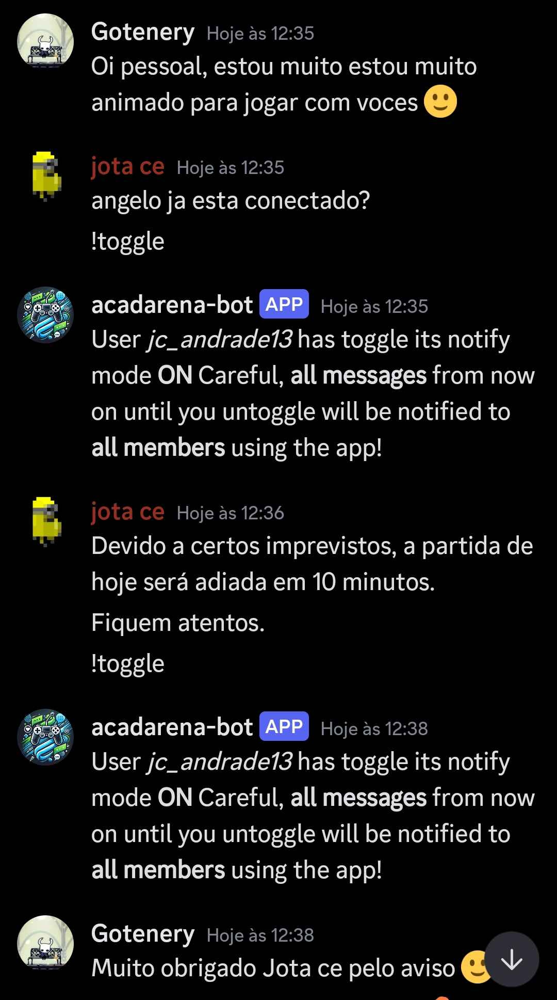

# AcadNotify

Project made for SEMCOMP27 Hackathon 2024.

## About!

[Canvas link.](https://www.canva.com/design/DAGUH6cS0aM/GHZReRCcdXbaEeLVEMWNFw/edit?utm_content=DAGUH6cS0aM&utm_campaign=designshare&utm_medium=link2&utm_source=sharebutton)

[Figma link.](https://www.figma.com/design/99xcQLm5VJTWJSJzSA51bx/AcadArenaApp?node-id=9-102&node-type=frame&t=toPgQGJVGcnGbEfa-0)

Our project involves bringing the enterprise and the users closer together by shortening their spaces. The main functionality of our application is an App for mobile that authenticates to the ChallengerMode public API to retreive and update data from the users account, without having to open the ChallengerMode website everytime.


The user may seek for next events and tournaments subscription, as well as receive push notifications from moderators. But how?
Well, we have a discord bot that, when toggled by moderators, keeps track of all the messages they send, **broadcasting them instantly** to the intented users by push notifications on the mobile app.



Example of broadcasting images.

Besides, the user may control some of its actions through the notifications bar, like joining or declining a match **without having to leave the current game**. This is specially useful for mobile platform users, where switching tabs are not practical. See the images below:


Example of notification with user interaction.


Example of push notification.

## Requirements

If you want to run the ecosystem on your own, you'll have to download some requirements as follow:
Flask, `python-dotenv`, discord bot for python and sqlite3 util.

```bash
    pip install Flask
    pip install python-dotenv
    sudo apt install sqlite3 # if ubuntu

    pip install discord
```

## How to run

It should be noted that it won't work out of the box due to the necessary credentials and privilege accesses for the discord bot. It should however be intuitive. At any questions or suggestions, please reach out to Jose Carlos and feel free to ask!

After the necessary credentials, it follows:

The `flask` server is the first one that should be initialized as:

```bash
    cd api
    python3 Server.py
```

And then, you'll need to initalize the discord bot.

```bash
    cd discord-bot
    python3 acadarena-discord.py
```

Now, there's only the flutter app left to run.

## Developed by

- José Carlos Andrade do Nascimento
- Shogo Shima
- Gabriel Barbosa dos Santos
- Ângelo Antônio Bertoli Guido
